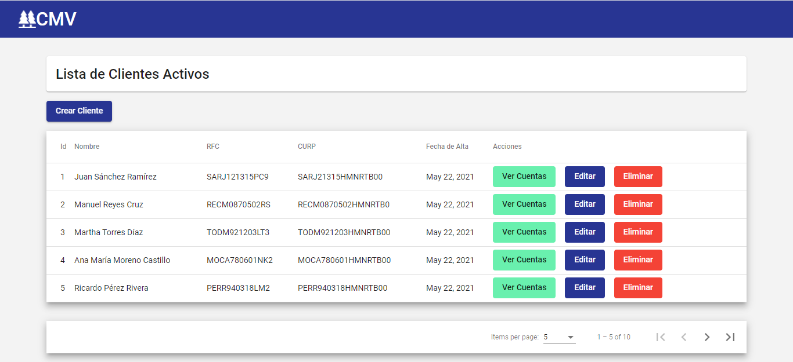
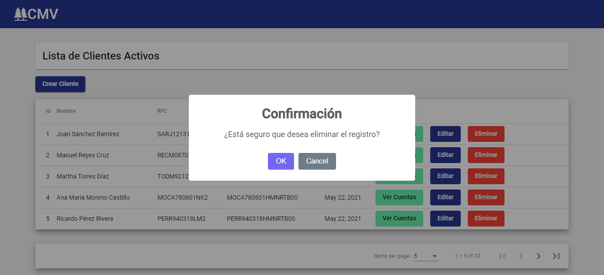
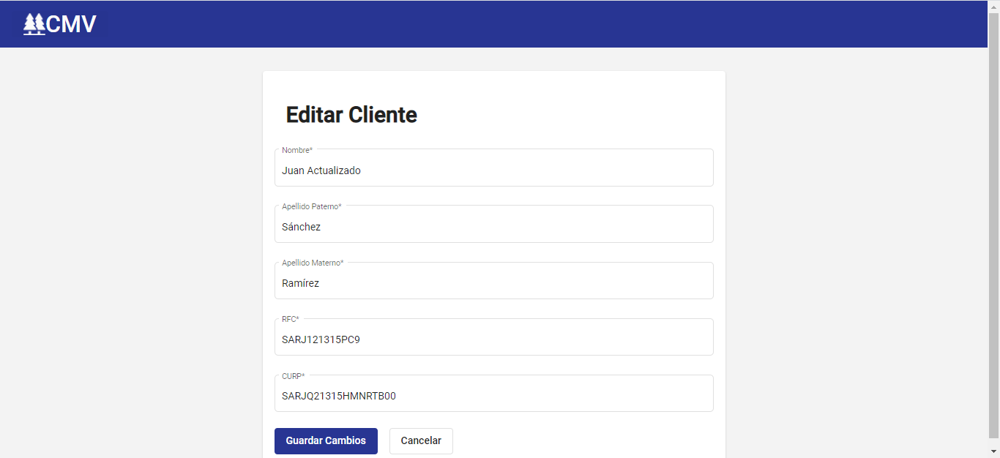
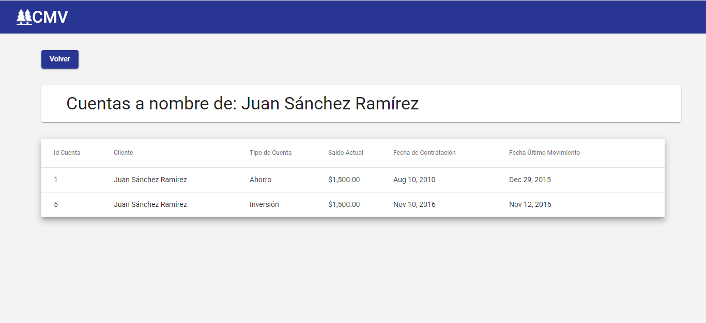
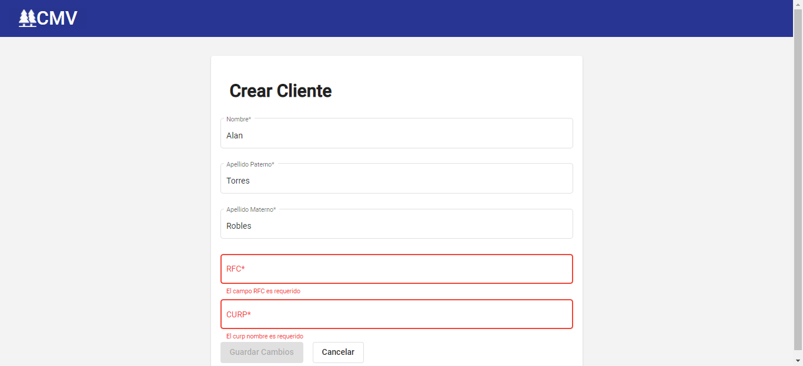
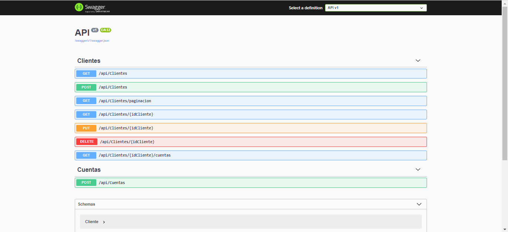

# Repositorio Para el Examen de Programador de CMV

En el presente repositorio se encuentran todos los archivos, y código generado para desarrollar el sitema Web propuesto.

## Tecnologías utilizadas:

- Microsft SQL Server Express 2019
- ASP.NET (.NET 5)
- Angular 11
- Angular Material 11

## Estructura del repositorio

A continuación se enlistan los propósitos de las 4 carpetas ubicadas en la raiz.

### API:

En esta carpeta se encuentra el proyecto de ASP.NET utilizado para la creación de la API, se utilizó la version de .NET 5 y la tecnología ADO.NET para la conexión con la Base de Datos.

**Importante actualizar la cadena de conexión a la BD, esta se localiza dentro de la carpeta API en:**

`API/appsettings.Development.json` 
en la línea 10: 
`"DefaultConnection": "Data Source=GABRIELPC\\SQLEXPRESS;Initial Catalog=CMV;Integrated Security=SSPI;"` 
Actualizar con las credenciales correspondientes

Al ejecutar el proyecto de Backend se deplegará en el navegador la lista de enpoints generados. Para se utilizó la herramienta Swagger que ya viene incorpara en el proyecto.

**Se habilitó CORS para cualquier origen, cualquier Método y cualquier Header, tomarlo en consideración si lo ejecuta en alguna red pública**

### Capturas:

En esta ruta se localizan capturas de pantalla del sistema (se muestran al final de este README).

### Database Scripts:

En esta carpeta se localizan todos los scripts necesarios para la creación de la Base de Datos listados en el siguiente orden:
Archivo | Descripción
------------ | -------------
01 CMV Database - Creacion DB - Tablas.sql | Script que contiene las sentencias necesarias para crear la BD y las tablas que la conforman
02 CMV Database - SP Listar Clientes.sql | Stored Procedure para listar todos los clientes
03 CMV Database - SP Crear Cliente.sql | Stored Procedure para crear un cliente
04 CMV Database - SP Editar Cliente.sql | Stored Procedure para editar los campos de un cliente
05 CMV Database - SP Eliminar Cliente.sql | Stored Procedure para eliminar un cliente por ID
06 CMV Database - SP Crear Tipo Cuenta.sql | Stored Procedure para crear un nuevo tipo de cuenta, por ejemplo, Ahorro o Préstamo
07 CMV Database - SP Crear Cliente Cuenta.sql | Stored Procedure para crear una nueva cuenta para un cliente determinado
08 CMV Database - SP Listar Cliente Cuentas.sql | Stored Procedure para listas todas las cuentas asociadas a un cliente por ID
09 CMV Database - SP Listar Cliente.sql | Stored procedure para consultar un cliente por ID
10 CMV Database - SP Listar Clientes Paginacion.sql | Stored Procedure para listas los clientes utilizando paginación mediante la sentencia OFFSET/FETCH
11 CMV Database - Cargar Datos.sql | Script que utiliza los scripts antes mencionados para insertar datos de prueba en la BD. Se insertar 3 tipos de cuentas. 10 clientes y 11 cuentas asociadas a ciertos clientes.
12 CMV Database - Backup.bak | Archivo de Backup de la BD con la estructura ya creada, procedimientos almacenados y datos insertados.

**Es Importante ejecutar los scripts en el orden indicado por su nombre, en caso de que desee construir la BD a partir de ellos. Se debe comenzar por el script 01 CMV Database - Creacion DB - Tablas.sql y continuar así hasta 11 CMV Database - Cargar Datos.sql.
El archivo número 12 sólo existe por si desea crear la BD sin los scripts**

### Frontend

En esta carpeta se localiza en proyecto de Angular utilizado para desarrollar la aplicación Web.

**Importante actualizar la ruta de la api localizada en:**

`src/environments/environment.ts`  
en la línea 7:  
`baseApiUrl: "https://localhost:44318/api/"`

de acuerdo a la ruta de su backend.

Una vez hecho esto, puede ejecutar el proyecto utilizando los comandos dentro de la carpeta Frontend:

`npm install` 
`ng serve`

### Capturas de pantalla

Listado de clientes

Alerta de eliminación de clientes

Formulario de editar cliente

Listado de cuentas asociadas a un cliente

Formulario de nuevo cliente con validaciones

Lista de enpoints de la API
